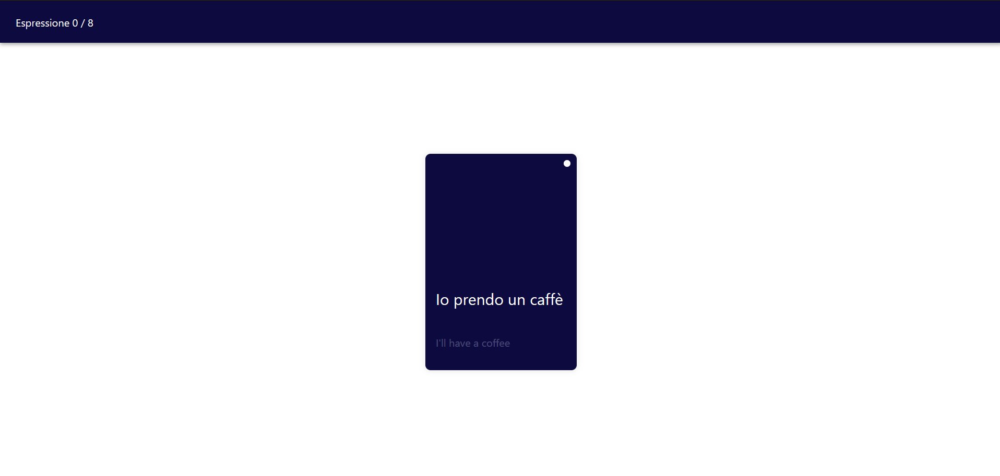

# Espresso Language Learning App

Welcome to Espresso, the language learning app that lets you enhance your language skills while enjoying a cup of coffee!

## Table of Contents

- [Introduction](#introduction)
- [Features](#features)
- [Getting Started](#getting-started)
- [Usage](#usage)
- [Customization](#customization)
- [Contributing](#contributing)
- [License](#license)

## Introduction

Espresso is a web application designed to make language learning a delightful experience. The claim, "learning while drinking a caffé", reflects the idea that language learning should be enjoyable and seamlessly integrated into your daily routine.



## Features

- **Swipe Interface:** Easily indicate your understanding of expressions by swiping left or right.
- **React Framework:** Built with React for a responsive and interactive user experience.
- **Expression Repository:** Expressions to learn are stored in a JSON file at `src/data/expressions.json`.

## Getting Started

To get started with Espresso, follow these steps:

1. Clone the repository to your local machine:
   ```bash
   git clone https://github.com/hueper/espresso.git
   ```
2. Navigate to the project directory:
   ```bash
   cd espresso
   ```
3. Install dependencies using Yarn:
   ```bash
   yarn install
   ```
4. Start the development server:
   ```bash
   yarn start
   ```
5. Open your browser and visit http://localhost:3000 to view Espresso.

## Usage
Once you have Espresso up and running, you can start using it to enhance your language skills. Swipe left if you didn't understand the expression, and swipe right if you did.

## Customaization
Feel free to customize Espresso to better fit your needs. You can modify the expressions in the expressions.json file to tailor the learning content to your preferences.

## Contributing
If you'd like to contribute to Espresso, follow these steps:

1. Fork the repository on GitHub.
2. Clone your forked repository to your local machine.
3. Create a new branch for your feature or bug fix.
4. Make your changes and commit them with descriptive commit messages.
5. Push your changes to your GitHub repository.
6. Submit a pull request to the main repository.

## License

Espresso is released under the [MIT License](https://github.com/hueper/espresso/blob/main/LICENSE).